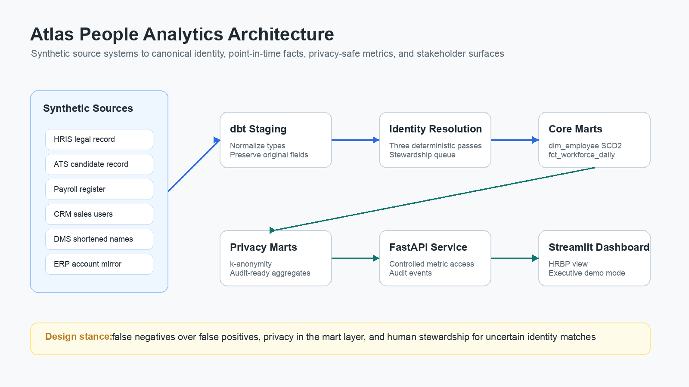
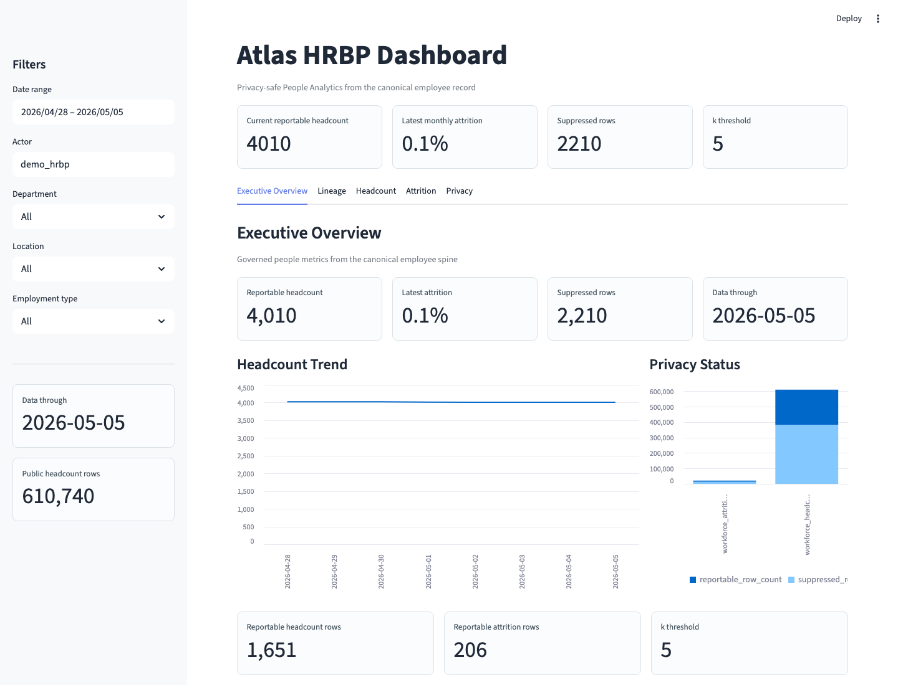
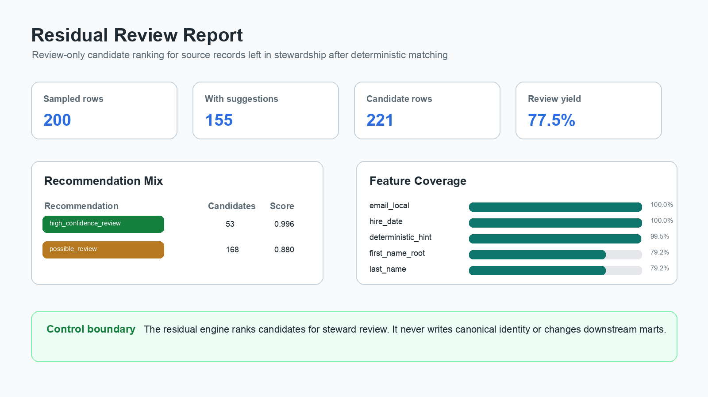

# Atlas - Canonical Employee Record for People Analytics

> Atlas is a synthetic People Analytics reference project that builds a governed employee identity spine across messy operational systems, then uses that spine to power point-in-time workforce metrics, privacy-safe marts, an API, and a dashboard.

**Stack:** Python · dbt · Snowflake · Airflow · FastAPI · Streamlit · GitHub Actions

---

## Start Here

If you are reviewing Atlas quickly, these artifacts give the shortest path through the project:

- [Dashboard Executive Overview](docs/assets/dashboard-executive-overview.png) - the dashboard surface.
- [Demo Script](docs/00-demo-script.md) - a concise guided walkthrough.
- [Identity Drift Recovery Walkthrough](docs/walkthroughs/identity-drift-example.md) - the core identity-resolution example.
- [Residual Review Walkthrough](docs/walkthroughs/residual-review-walkthrough.md) - the stewardship workflow for unresolved identities.
- [Atlas A-to-Z Source Walkthrough](docs/atlas-a-to-z-source-walkthrough.md) - the full source-indexed implementation guide.

The main point: Atlas is not primarily a dashboard. It is a governed employee identity and workforce metrics foundation, with API and dashboard surfaces sitting on top of that foundation.

---

## The Problem

People Analytics reporting is only as trustworthy as the employee identity layer underneath it.

In real operating environments, the same person often appears differently across systems. The HRIS may store a legal name, payroll may lag a name change, the ATS may retain a preferred name from the candidate stage, the CRM may use a sales-facing alias, and downstream tools may carry shortened or manually entered names. Rehires, terminations, contractor conversions, system migrations, and email-domain changes make the drift worse over time.

Each source can look correct in isolation while cross-system reporting is wrong. Headcount can be double-counted. Attrition cohorts can be misclassified. Compensation and performance analysis can attach facts to the wrong employment spell.

Atlas demonstrates how to solve that problem with a canonical employee record: a stable analytical identity that survives source-system drift and becomes the backbone for workforce reporting.

## Design Principles

- **Deterministic before probabilistic:** identity rules are explicit, auditable, and tested.
- **False negatives over false positives:** uncertain matches go to stewardship instead of being silently merged.
- **Point-in-time correctness:** workforce facts are modeled by date, not only by the latest employee row.
- **Privacy by design:** sensitive identifiers stay out of public marts and small cohorts are suppressed.
- **Product-shaped data assets:** the system includes documentation, tests, serving contracts, audit logging, and a review workflow.

## What Atlas Builds

Atlas starts with six synthetic operational sources and turns them into a governed People Analytics serving layer:

1. **Synthetic source systems** for HRIS, ATS, payroll, CRM, DMS, and ERP, including realistic identity drift.
2. **Staging models** that preserve source-system meaning while normalizing names, types, dates, and email anchors.
3. **A deterministic identity matcher** that emits one stable `canonical_person_id` per resolved person.
4. **A stewardship queue** for records that should be reviewed rather than auto-merged.
5. **Core workforce marts** with an SCD-style `dim_employee` and daily `fct_workforce_daily` date-spine fact table.
6. **Privacy-safe People Analytics marts** for headcount, attrition, suppression summaries, and audit events.
7. **Operational surfaces** through Airflow orchestration, FastAPI metric endpoints, and a Streamlit dashboard.
8. **Residual review tooling** that ranks unresolved candidates for manual adjudication without writing canonical truth.

## Architecture

```
        ┌─────────────────── Source Systems ──────────────────┐
        │  HRIS (legal name)    ATS (preferred name)          │
        │  Payroll (legal+SIN)  CRM (preferred name)          │
        │  DMS (shortened name) ─→ ERP (mirrors DMS)          │
        └──────────────────────┬──────────────────────────────┘
                               │
                  Airflow DAG  ▼
                       ┌──────────────┐
                       │  raw schema  │
                       └──────┬───────┘
                              ▼
                       ┌──────────────┐
                       │  staging     │  source mirrors, typed and normalized
                       └──────┬───────┘
                              ▼
                       ┌──────────────┐
                       │ intermediate │  identity nodes, deterministic passes,
                       │              │  canonical people, stewardship queue
                       └──────┬───────┘
                              ▼
                       ┌──────────────┐
                       │ core marts   │  dim_employee, fct_workforce_daily
                       └──────┬───────┘
                              ▼
                       ┌──────────────┐
                       │ people       │  headcount, attrition, suppression,
                       │ analytics    │  privacy audit events
                       └──────┬───────┘
                              ▼
                ┌─────────────┴──────────────┐
                ▼                            ▼
        ┌──────────────┐            ┌──────────────┐
        │  FastAPI     │            │  Streamlit   │
        │  metrics svc │            │  dashboard   │
        │  (k-anon)    │            │              │
        └──────────────┘            └──────────────┘
```

## Identity Resolution

The identity layer lives in `dbt_project/models/intermediate/` and uses a conservative three-pass matcher:

- `int_identity_source_nodes` standardizes HRIS, ATS, payroll, CRM, DMS, and ERP records onto a common matching grain.
- `int_identity_pass_1_hard_anchors` resolves the safest exact anchors, such as personal-email and work-email-local-part matches.
- `int_identity_pass_2_name_dob_hire` evaluates normalized first-name-root, last-name, DOB, and hire-date proximity.
- `int_identity_pass_3_email_domain` recovers harder company-domain and last-name-token matches with uniqueness controls.
- `int_canonical_person` emits the canonical identity spine.
- `int_stewardship_queue` captures unresolved source identities with the best available evidence for human review.

Payroll records are intentionally routed to stewardship where the synthetic feed lacks a stable DOB/email bridge and where generated SIN_LAST_4 values are not stable across pay periods. That is a deliberate governance choice: in people data, an incorrect merge is more damaging than an unresolved record.

## Workforce Modeling

The core marts turn identity into point-in-time workforce facts:

- `dim_employee` models HRIS employment spells as SCD-style rows keyed by `canonical_person_id`.
- `fct_workforce_daily` emits one row per employee spell per calendar date from hire through termination or the configured as-of date.
- Headcount uses `is_active_on_date = true`.
- Attrition can count `is_termination_date = true` without losing the employee's historical state.
- Full DOB and SIN_LAST_4 do not propagate into core or public-facing marts.

This structure supports questions like "Who was active on March 31?" or "What was attrition for this department last month?" without relying on the latest employee row to describe the past.

## Privacy And Serving

The public People Analytics layer is designed for governed consumption:

- `workforce_headcount_daily` returns daily headcount by department, location, and employment type.
- `workforce_attrition_monthly` returns monthly attrition using the same business-facing dimensions.
- Small cohorts are protected through k-anonymity suppression.
- Suppressed rows remain visible for orientation, but exact small-cohort metrics are nulled.
- `privacy_suppression_summary` reports how many rows are reportable vs suppressed.
- `privacy_audit_log` stores metric access events from the API.

The FastAPI service reads only from privacy-safe marts, rejects unsafe configured identifiers, and records actor, purpose, filters, row counts, and suppression counts for metric requests. The Streamlit dashboard consumes the API rather than querying sensitive warehouse layers directly.

## Residual Review

Atlas also includes a review-only residual workflow in `identity_engine/` for records left in the stewardship queue.

The residual engine scores candidate canonical people using explainable features such as first-name-root, last-name similarity, email-local-part similarity, hire-date proximity, and deterministic hints. Recommendations are intentionally non-authoritative:

- `high_confidence_review`
- `possible_review`
- `do_not_suggest`

The workflow is designed to reduce review effort, not to update `int_canonical_person`. Any match still requires a governed stewardship decision before it can influence canonical records or downstream marts.

## Verification

Atlas is tested across dbt, Python, and operational boundaries.

Key validation results from the current repository state:

- Identity matcher build: `172/172` dbt resources passed, producing `5,000` canonical people and `6,985` stewardship queue records.
- Core workforce build: `195/195` dbt resources passed, producing `5,157` employee spell rows and `4,456,107` daily workforce rows.
- Privacy mart build: `235/235` dbt resources passed, with below-k public metrics suppressed.
- Python test suite: `15` tests passing across API, DAG import, dashboard helpers, and residual review logic.
- Static checks: `ruff`, `mypy`, `dbt parse`, and `git diff --check` have been run during development.

Useful commands:

```bash
make build
make test
make lint
make dag-test
```

## Repository Structure

```
atlas-people-analytics/
├── docs/                     # Architecture notes, walkthroughs, screenshots
├── seeds/                    # Synthetic data generator
├── dbt_project/              # dbt models, tests, macros, fixtures, seeds
├── airflow/                  # Airflow DAG
├── identity_engine/          # Residual identity review tooling
├── api/                      # FastAPI privacy-aware metrics service
├── dashboard/                # Streamlit dashboard
├── tests/                    # Python tests
├── infra/                    # Snowflake provisioning SQL
├── .github/workflows/        # CI/CD
├── Makefile                  # Local developer commands
└── pyproject.toml            # Python package and tooling config
```

## Screenshots







## Quick Start

> This project is configured for Snowflake. You will need a Snowflake account; a trial account is sufficient.

```bash
# 1. Clone and install
git clone https://github.com/<your-username>/atlas-people-analytics.git
cd atlas-people-analytics
python -m venv .venv && source .venv/bin/activate
pip install -e ".[dev]"

# 2. Configure Snowflake credentials
cp .env.example .env
# Edit .env with your account, user, role, warehouse, and database.

# 3. Provision Snowflake objects
make snowflake-init

# 4. Generate synthetic data and load the raw schema
make seed

# 5. Build models and run tests
make build
make test

# 6. Launch the API and dashboard
make api
make dashboard
```

Local service URLs:

- API docs: `http://127.0.0.1:8000/docs`
- Dashboard: `http://localhost:8501`

## Documentation

- [Demo Script](docs/00-demo-script.md)
- [Identity Drift Recovery Walkthrough](docs/walkthroughs/identity-drift-example.md)
- [Residual Review Card](docs/07-residual-review.md)
- [Residual Review Walkthrough](docs/walkthroughs/residual-review-walkthrough.md)
- [Residual Review Report](docs/walkthroughs/residual-review-report.md)
- [Residual Ranking Diagnostics](docs/walkthroughs/residual-ranking-evaluation.md)
- [Atlas A-to-Z Source Walkthrough](docs/atlas-a-to-z-source-walkthrough.md)

## License

MIT - see [LICENSE](LICENSE).

---

Atlas is a portfolio reference implementation, not a production system to deploy as-is. The data is synthetic, and the patterns are intended to demonstrate how a governed People Analytics foundation can be designed, tested, and served.
